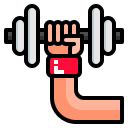
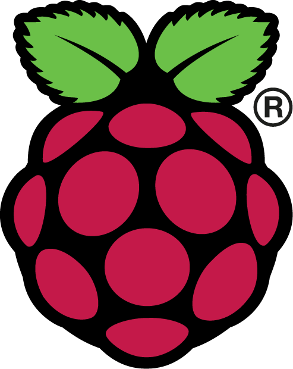
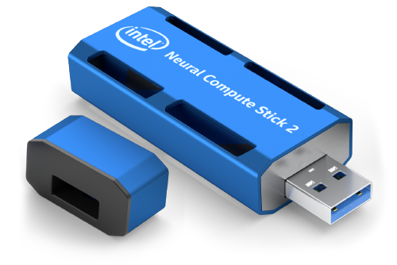

# GymCam

 

## Description
In this project, my overall goal was to assist individuals in the gym or at home by employing Raspberry Pi and Camera technology into practical use. More specifically, this design is intended to aid one in improving how they do squats by allowing them to view their form from a different angle. Simultaneously, with using human pose estimation and face recognition, one is able to view lines on their screen according to their body, forming a precise image of what they look like while working out. The camera will be placed to the side, and the video will be streamed directly to their phone, which is placed in front of the individual.

## What Was Used
### Hardware
-  [Raspberry Pi 3 B+](https://www.raspberrypi.org/products/raspberry-pi-3-model-b-plus/) comes along with 1.4GHz 64-bit quad-core ARM Cortex-a53 CPU, ethernet, Availability for LAN and Bluetooth connections, and various other features.
-  [Pi Camera 2](https://www.raspberrypi.org/products/camera-module-v2/) allowed me to stream videos with pretty good quality, containing a 8-megapixel sensor. Used to collect frames used by the face recognition and human pose model. Resolution - 3280 × 2464 pixels. The camera captures 62 degrees horizontally. 
-  [Intel Neural Compute Stick 2](https://store.intelrealsense.com/buy-intel-neural-compute-stick-2.html?cid=sem&source=sa360&campid=2019_q3_egi_us_ntgrs_nach_revs_text-link_brand_bmm_desk_realsense-shopping-ad_o-1lngr_google&ad_group=RealSense+Shopping+Ads&intel_term=PRODUCT_GROUP&sa360id=92700050119513690&gclid=Cj0KCQjw6ar4BRDnARIsAITGzlAEl_pPpmhuDqj5YzaGbwqQQt7DydVdqa9CFmBKrp84k-MuU5R5FC0aAoAQEALw_wcB&gclsrc=aw.ds) is an NPU (Neural Processing Unit) that allowed the program to run much more efficiently. This was used to run the OpenCV DNN (Deep Neural Network) for OpenPose and face recognition.
-  [PIM183 PanTiltHat](https://shop.pimoroni.com/products/pan-tilt-hat?variant=33704345034) has great movement, can tilt and pan to face the camera up, down, and to the side. Can turn 180 degrees horizontally and vertically and was used to place the person's head in the middle/upper side of the video stream.
### Hardware Components Setup
-  Attach the camera to the pan-tilt model using the provided plastic screws and bolts.
-  Attach the pan-tilt model to the HAT using the four provided screws.
-  Connect the camera cable to raspberry pi camera module port.
-  Connect the two servo wires to the HAT.
-  Attach the Pan-Tilt HAT pinout compatible to the 40-pin header Raspberry Pi models.
-  Connect the Intel [Neural Compute Stick 2] to one of the Raspberry Pi USB ports
-  Optional - use a [raspberry pi case](https://www.amazon.com/Raspberry-iUniker-Heatsink-Model-Single/dp/B01LXSMY1N) protect the raspberry pi and add a slot for a battery bank to power it.

     

### Raspberry Pi OS Setup
-  For software, I began this project by connecting an SD card to my computer and installing [Raspberry Pi OS](https://www.raspberrypi.org/documentation/installation/installing-images/). I then attached the SD card to the Raspberry Pi and started it up. Raspberry Pi OS is the operating system for Raspberry Pi. Now, I could treat the Raspberry Pi as a regular computer and install the software and programs I desire.
### Installing Rquired Software Modules
-  [OpenCV](https://docs.opencv.org/4.2.0/) is an open source python library that provides a rich functionality for capturing video stream from the camera and processing video frames and preparing data to be consumed by the face recognition and human pose models. I'm also using OpenCV to resize and rotate the video stream. OpenCV is included in OpenVino and will be installed in the next step.
-  [OpenVino](https://docs.openvinotoolkit.org/) is a comprehensive toolkit for developing computer vision applications. Based on Convolutional Neural Networks (CNNs), the toolkit extends computer vision workloads across Intel® hardware, maximizing performance. Using the [instructions](https://www.pyimagesearch.com/2019/04/08/openvino-opencv-and-movidius-ncs-on-the-raspberry-pi/) provided by Adrian Rosebrock from PyImageSearch, I followed the steps, starting from step #1, and ending at step #9.
-  [Pantilthat Python Library](https://pypi.org/project/pantilthat/) installation with a simple command- "pip install pantilthat"- in the command line. This will be used in code to control the movements of the pantilthat, aiming the camera in the direction I desire.
-  [TriangleSolver Python Library](https://pypi.org/project/trianglesolver/) applied fundamentals of trigonometry and allowed me to calculate the movement of the camera to where the persons' face is located at the center and upper half of the video. I installed the Python Triangle Solver with the command- "pip install trianglesolver"- in the command line.
-  [Flask](https://pypi.org/project/flask-opencv-streamer/) is used so that the weightlifter can open up the video stream on their phone through the web browser. I used Flask Python OpenCV Streamer to make the program stream the video. I installed the flask OpenCV streamer with a simple command in the command line- "pip install flask-opencv-streamer". With Flask, the camera can then placed on the side, facing the weightlifter, and the video is streamed to their phone, which is faced directly in front of the individual.
### Computer Vision Machine Learning Models
Two very popular computer vision ML models were used to accomplish the objective of my project. I was able to research and find two good articles that helped me implement the solution without having to create the ML models from scratch. Below are the two guides for the open pose and face recognition models:
-  [OpenPose](https://www.learnopencv.com/deep-learning-based-human-pose-estimation-using-opencv-cpp-python/) allows the individual to see an outline of their body with lines running along their limbs, torso, and head. With this, the weightlifter will be able to see their form more clearly and see what improvements they can make so that the lines are more aligned and form a 90 degree angle while performing a squat. OpenPose focuses on human pose estimation, which aims at pinpointing major joints and parts of the body, such as the knees and shoulders. With all the major parts of the body detected, lines will be drawn to connect these points and form a general outline of the body. In fact, this is done in real-time, while the stream is ongoing, and will move with the individual's movements. To display the individual's pose, I used the OpenCV Deep Neural Network (DNN) with a pre-trained OpenPose Caffe model and ran the algorithm on the Intel Compute Stick. I followed these steps by Vikas Gupta from [LearnOpenCV.com](https://www.learnopencv.com) to assist me in the process.
-  [Face Recognition Model](https://www.pyimagesearch.com/2020/01/06/raspberry-pi-and-movidius-ncs-face-recognition/) has an detector and an embedder. The detector is Caffe-based and is used to detect a face in the image, and the embedder is Torch-based and is used to recognize the face. Once the model recognizes the individual's face with an acceptable confidence level, the position of the face is used to pan and tilt the camera horizentally and vertically to ensure that the individual's face is always in the upper/center part of the video frame. I followed the instructions provided by Adrian Rosebrock from PyImageSearch to learn about the model and configure my project with face recognition.
## Training the face recognition model
Now that we have downloaed all the required face-recognition and openpose models as per the above articles, we are ready to train the face recoginition model using my own pictures. I was able to do so by following the steps given by Rosebrock:
-  Created my own data set by taking 60 pictures of my face using my iPhone camera with various lighting and angles.
-  Converted them from HEIC to JPEG using a [free online tool](https://freetoolonline.com/heic-to-jpg.html). 
-  Placed the pictures into the "dataset" folder.
-  Ran the command, "source ~/start_openvino.sh," to initialize OpenVino.
-  Ran the following command in the command line in order to extract the pictures from the "dataset" folder to the "output" folder and update the "embeddings.pickle" file using the face_embedding_model: 

          $ python extract_embeddings.py \
          --dataset dataset \
          --embeddings output/embeddings.pickle \
          --detector face_detection_model \
          --embedding-model face_embedding_model/openface_nn4.small2.v1.t7

-  Then, I trained the model with the following the command:

          $ python train_model.py --embeddings output/embeddings.pickle \
          --recognizer output/recognizer.pickle --le output/le.pickle

## Download the OpenPose Models

## Pantilthat Movement
-  In order to get the camera to place the individual's face exactly in the center and upper side of the screen, I had to apply Law of Cosines and Law of Sines in order to calculate the angle at which the Pantilthat was required to move. Since I aimed the individual's face to be in the center of the screen on the x-axis, a right-triangle was formed between the camera, the individual, and the center of the screen. I then could use given side lengths and angles in order to find the missing angle, which was the angle at which the camera moved in order to get the individual's face to the center of the screen. 
- For the y-axis, a simpler method was used: if the location of the regonized facve 

The command- "setPreferableTarget(cv2.dnn.DNN_TARGET_MYRIAD)"- in the gymcam_streamer.py program that tells OpenCV to use the Intel Neural Compute Stick 2 to run the model.

 Now, with all the components combined, the individual can see their form while squatting and work on ways to improve his or herself. Furthermore, this can be implemented into other workouts, other than squatting, in order for the weightlifter to improve their form.

 -  Once completed, to test it, I ran this command:

          $ python videoStreamer.py --detector face_detection_model \
          --embedding-model face_embedding_model/openface_nn4.small2.v1.t7 \
          --recognizer output/recognizer.pickle \
          --le output/le.pickle
